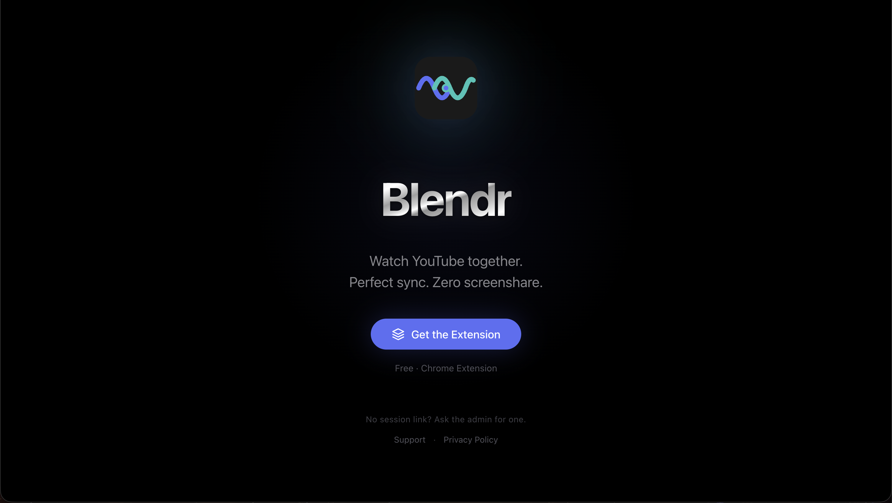
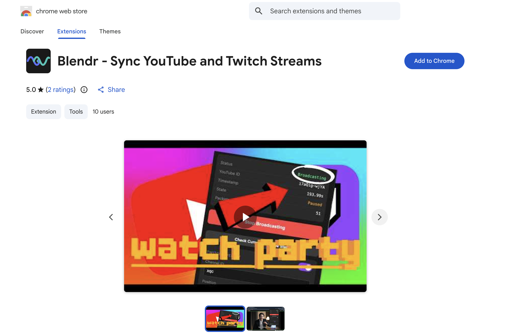

# Blendr

<p align="center">
  
</p>

<h3 align="center">Watch YouTube together. Perfect sync. Zero screenshare.</h3>

<p align="center">
  Blendr lets one host control playback from YouTube while everyone else joins from a clean browser link.
</p>

<p align="center">
  <a href="https://blendr.live"><strong>Website</strong></a>
  ·
  <a href="https://chromewebstore.google.com/detail/blendr-sync-youtube-and-twitch-streams/dhijdnhjdpoiegbagdcjgaokoljgdbno"><strong>Chrome Extension</strong></a>
  ·
  <a href="https://www.youtube.com/watch?v=DLIPH8Bs6MI"><strong>Demo</strong></a>
  ·
  <a href="./docs/RUNBOOK.md">Runbook</a>
  ·
  <a href="./docs/PROTOCOL.md">Protocol</a>
</p>

<p align="center">
  <a href="https://www.youtube.com/watch?v=DLIPH8Bs6MI">
    
  </a>
</p>

<p align="center">
  <a href="https://blendr.live">
    
  </a>
</p>

<p align="center">
  <a href="https://chromewebstore.google.com/detail/blendr-sync-youtube-and-twitch-streams/dhijdnhjdpoiegbagdcjgaokoljgdbno">
    
  </a>
</p>

## What It Does

Blendr turns a normal YouTube tab into a watch party host. The admin starts a session from the Chrome extension, shares the generated Blendr link, and viewers stay locked to the host's playback state without a screenshare, meeting room, or shared account.

The current production stack is live at:

| Surface | URL |
| --- | --- |
| Website | https://blendr.live |
| API | https://api.blendr.live |
| Chrome extension | Chrome Web Store ID `dhijdnhjdpoiegbagdcjgaokoljgdbno` |

## How It Works

1. The admin opens a YouTube video and starts broadcasting from the Chrome extension.
2. The extension creates a session with `POST /api/session/create`, then connects as the authenticated admin over WebSocket.
3. The content script reads the YouTube `<video>` state and sends sync packets through the background service worker.
4. The API keeps session state in memory, tracks session metadata in Redis, and broadcasts state to viewers.
5. Viewers open `https://blendr.live/watch?session=...`; the website connects as a read-only viewer and drives the YouTube IFrame player.

## Repository Layout

```text
blendr/
├── apps/
│   ├── website/          # Next.js viewer app deployed by Vercel
│   ├── api/              # Bun WebSocket/API server deployed on GCP
│   └── admin-extension/  # Chrome MV3 admin broadcaster extension
├── docs/
│   ├── PROTOCOL.md       # HTTP/WebSocket protocol and session lifecycle
│   └── RUNBOOK.md        # Local dev, deploy, release, and operations
├── infra/
│   ├── caddy/            # Production reverse proxy config
│   └── systemd/          # Production API service unit
├── scripts/
│   ├── dev-local.sh
│   ├── start-api.sh
│   ├── deploy-api.sh
│   └── package-extension.sh
├── AGENTS.md
├── LICENSE
├── package.json
├── pnpm-workspace.yaml
└── vercel.json
```

## Local Development

Prerequisites:

- Bun 1.1+
- Node.js 18+
- npm or pnpm
- Chrome for extension testing

Start the full local stack:

```bash
./scripts/dev-local.sh
```

Access points:

| Service | URL |
| --- | --- |
| Website | http://localhost:3000 |
| API | http://localhost:6767/api/session/create |
| WebSocket | ws://localhost:6767/ws |

Manual commands:

```bash
cd apps/api && bun run dev
cd apps/website && npm run dev
```

For extension testing, load `apps/admin-extension` as an unpacked extension in Chrome. `scripts/dev-local.sh` temporarily points `apps/admin-extension/config.js` at localhost and restores production config on exit.

## Production

- Website: Vercel builds `apps/website` using `vercel.json`.
- API: GCP VM `hdtrs`, Caddy on ports `80/443`, Bun bound to `127.0.0.1:6767`, Redis local on `127.0.0.1:6379`.
- Extension: packaged from `apps/admin-extension`; production endpoints must stay `https://api.blendr.live` and `wss://api.blendr.live`.

Operational details live in:

- [docs/RUNBOOK.md](./docs/RUNBOOK.md)
- [docs/PROTOCOL.md](./docs/PROTOCOL.md)

## Checks

```bash
cd apps/api && bunx tsc --noEmit
cd apps/website && npm run build
./scripts/package-extension.sh
```

`package-extension.sh` queries the Chrome update endpoint and refuses to create `blendr-admin-extension.zip` unless `apps/admin-extension/manifest.json` is higher than the currently published version.

## License

Apache License 2.0. Copyright 2026 Mihir Belose.
